<!-- 
  Aman Tikariha's Enhanced Profile README 🚀
  -------------------------------------------------------------
  Instructions:
  1. Upload the 'assets' folder to your GitHub Profile Repository (the repository named after your GitHub username).
  2. Replace 'YOUR_GITHUB_USERNAME' with your actual GitHub username.
  3. Replace 'YOUR_LINKEDIN_URL' and 'YOUR_GITHUB_URL' with your social profile URLs.
  4. Commit and push these changes!
-->

<p align="center">
  
</p>

<p align="center">
  <a href="YOUR_LINKEDIN_URL" target="_blank">
    
  </a>
  <a href="YOUR_GITHUB_URL" target="_blank">
    
  </a>
  <a href="mailto:amantikariha56@gmail.com">
    
  </a>
</p>

---

## 👨‍💻 About Me

Hi there! I am **Aman Tikariha**, a B.Tech student specializing in **Artificial Intelligence & Machine Learning** and a passionate **Full Stack Developer**. I enjoy designing and building high-performance web applications, scaling systems, and exploring neural networks.

- 📍 **Location:** Raipur, Chhattisgarh, India
- 🌱 **Current Role:** Contributor at **GirlScript Summer of Code (GSSoC) 2026**
- ⚡ **Focus Areas:** Full Stack Architectures, Applied Deep Learning, and Open Source

---

## 🛠️ The Tech Ecosystem (Ecosystem Tree)

Below is an interactive visual of my skills and how they connect.

### 1. Interactive Mindmap (Mermaid)

```mermaid
flowchart TD
    %% Node Connections
    Aman["⚡ AMAN TIKARIHA ⚡"]
    
    %% Main Domains
    Aman --> Web["🌐 Full Stack Web"]
    Aman --> AI["🧠 AI / ML"]
    Aman --> OS["🚀 Open Source"]
    
    %% Web Branch
    Web --> Frontend["🎨 Frontend"]
    Web --> Backend["⚙️ Backend"]
    Web --> Database["💾 Data Layer"]
    
    Frontend --> FE1["React 19 & Next.js"]
    Frontend --> FE2["Three.js & GSAP (3D/Anim)"]
    Frontend --> FE3["Vite & Tailwind CSS"]
    
    Backend --> BE1["Node.js & Express"]
    Backend --> BE2["REST APIs & Routing"]
    Backend --> BE3["JWT Auth & RBAC"]
    
    Database --> DB1["MongoDB & Mongoose"]
    Database --> DB2["Cloudinary (Media)"]
    Database --> DB3["Multer (Uploads)"]
    
    %% AI Branch
    AI --> Langs["💻 Languages"]
    AI --> Core["🔬 Core Fields"]
    
    Langs --> L1["Python / C / C++"]
    Core --> C1["Neural Networks"]
    Core --> C2["System Design"]
    
    %% Open Source Branch
    OS --> Contrib["🌱 Contributions"]
    OS --> Tools["🛠️ Tooling"]
    
    Contrib --> Co1["GirlScript Summer of Code (GSSoC) 2026"]
    Tools --> T1["Docker & Vercel"]
    Tools --> T2["Git & GitHub Versioning"]

    %% Custom Colors and Styling (Matches the Dark/Neon theme)
    classDef default fill:#090d16,stroke:#1e293b,stroke-width:1px,color:#d1d5db;
    classDef root fill:#1e1b4b,stroke:#818cf8,stroke-width:2px,color:#f8fafc,font-weight:bold;
    classDef webStyle fill:#020617,stroke:#38bdf8,stroke-width:1.5px,color:#38bdf8;
    classDef aiStyle fill:#020617,stroke:#a855f7,stroke-width:1.5px,color:#a855f7;
    classDef osStyle fill:#020617,stroke:#ec4899,stroke-width:1.5px,color:#ec4899;
    classDef subStyle fill:#0f172a,stroke:#475569,stroke-dasharray: 5 5,color:#94a3b8;
    
    class Aman root;
    class Web webStyle;
    class AI aiStyle;
    class OS osStyle;
    class Frontend,Backend,Database,Langs,Core,Contrib,Tools subStyle;
```



### 2. File-System Style Tree Diagram
```
📦 aman-tikariha (main)
 ┣ 📂 Full-Stack Web Development
 ┃ ┣ 🎨 Frontend: React 19, Next.js, Vite, Three.js, GSAP, Tailwind CSS, HTML/CSS
 ┃ ┣ ⚙️ Backend: Node.js, Express.js, REST APIs, JWT Auth, RBAC, Bcrypt, Multer
 ┃ ┗ 💾 Database: MongoDB, Mongoose, Cloudinary
 ┣ 📂 AI / ML & Languages
 ┃ ┣ 💻 Core Languages: C, C++, Python, Javascript, TypeScript
 ┃ ┗ 🔬 Core AI/ML: Neural Networks, System Design, Data Structures
 ┗ 📂 DevOps & Open Source
   ┣ 🌱 Contributions: GSSoC 2026 Contributor
   ┗ 🛠️ DevOps & Tools: Docker, Git, GitHub, Vercel, VS Code
```

---

## 🛠 Tech Stack & Icons

<p align="center">
  
</p>

### Detailed Technologies

| Category | Technologies |
| :--- | :--- |
| **Languages** | `C` `C++` `Python` `JavaScript` `TypeScript` `HTML5` `CSS3` |
| **Frontend Core** | `React 19` `Next.js` `Vite` `Tailwind CSS` |
| **Interactive UI** | `Three.js (3D Node Visuals)` `GSAP (Animations)` |
| **Backend Core** | `Node.js` `Express.js` `REST APIs` `Google Apps Script` |
| **Security & Auth** | `JWT Authentication` `RBAC (Role-Based Access Control)` `Bcrypt` |
| **File Handling** | `Multer (Multipart upload)` `Cloudinary (CDN Integration)` |
| **Databases** | `MongoDB` `Mongoose (ODM)` |
| **Tools & DevOps** | `Docker` `Git` `GitHub` `Vercel` `VS Code` |

---

## 🚀 Featured Projects

<div align="center">
  <table border="0" cellspacing="0" cellpadding="10" style="border-collapse: collapse; border: none;">
    <tr>
      <!-- Project 1 -->
      <td width="50%" valign="top" style="border: 1px solid #1e293b; background-color: #090d16; padding: 15px; border-radius: 8px;">
        <h3 align="center">🍽️ QuickDine</h3>
        <p align="center"><strong>Restaurant Booking & Reservation Platform</strong></p>
        <p>A production-ready platform featuring role-based access control, real-time table reservations, dynamic search filters, and dashboard administration.</p>
        <p align="center">
          
          
          
          
        </p>
        <p align="center">
          <a href="https://quick-dine-hazel.vercel.app/" target="_blank">
            
          </a>
        </p>
      </td>
      <!-- Project 2 -->
      <td width="50%" valign="top" style="border: 1px solid #1e293b; background-color: #090d16; padding: 15px; border-radius: 8px;">
        <h3 align="center">🌐 Animated Portfolio</h3>
        <p align="center"><strong>Next-Gen Developer Showcase Portfolio</strong></p>
        <p>Modern animated portfolio designed to captivate visitors, featuring responsive 3D Three.js nodes, GSAP animations, and integrated Google Apps Script contact forms.</p>
        <p align="center">
          
          
          
          
        </p>
        <p align="center">
          <a href="https://portfolio-next-eta-seven.vercel.app/" target="_blank">
            
          </a>
        </p>
      </td>
    </tr>
  </table>
</div>

---

## 🌱 Learning Roadmap

- [x] **React 19 & Next.js** (Deployments & dynamic rendering)
- [x] **REST APIs & ODM** (Mongoose databases & backend routers)
- [ ] **Docker & DevOps** (Containerized apps & automated build scripts)
- [ ] **System Design** (Designing high-scalability, microservice structures)
- [ ] **AI Integration** (Integrating LLMs, neural networks, & AI pipelines into web engines)

---

## 🏆 Key Achievements

- 🏅 **Smart India Hackathon (SIH) 2025** – Selected for Internal Round
- 🏅 **HackOMania 2K25** – Participant & project presenter
- 🌟 **GSSoC 2026** – Open Source Contributor

---

## 📈 GitHub Metrics Dashboard

We customize these stats to match our glowing neon dashboard theme:

<div align="center">
  <table border="0">
    <tr>
      <td align="center" valign="top">
        
      </td>
      <td align="center" valign="top">
        
      </td>
    </tr>
    <tr>
      <td colspan="2" align="center" valign="top">
        
      </td>
    </tr>
  </table>
</div>

---

<p align="center">
  
</p>

<p align="center">
  ⭐ <strong>Thanks for visiting my developer profile!</strong> Feel free to fork this repository or star it! ⭐
</p>
